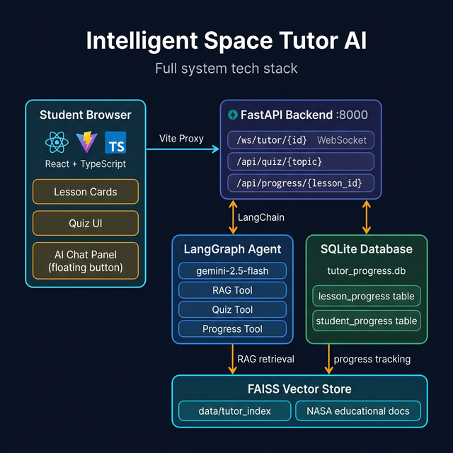

# 🚀 Intelligent Space Tutor AI

> An AI-powered educational platform that teaches children about space using **LangGraph agents**, **RAG (Retrieval-Augmented Generation)**, dynamic AI-generated quizzes, and a real-time streaming chatbot — wrapped in a stunning space-themed UI.

[](https://python.org)
[](https://fastapi.tiangolo.com)
[](https://react.dev)
[](https://langchain-ai.github.io/langgraph)
[](https://ai.google.dev)



---

## 📋 Submission Details

### Which Path & Why

**Path 2 — AI Architecture & Backend Engineering**

I chose Path 2 because the core challenge is not building another chatbot UI, but **designing a trustworthy AI tutoring system** for children. The critical problems are:

- **Hallucination prevention** — children need factually accurate answers, not confident guesses
- **Structured outputs** — the AI must produce consistent, typed responses the UI can safely render
- **Stateful multi-turn learning** — the AI must remember context across a session
- **Dynamic content generation** — quizzes must be fresh and topic-relevant, not hardcoded

LangGraph's agent framework with tool-calling and RAG solves all four problems cleanly.

### Trade-offs Made Due to Time Constraints

| Trade-off | What I chose | What I'd do with more time |
|---|---|---|
| **Authentication** | Single hardcoded `student_id` | JWT auth with proper user accounts |
| **Database** | SQLite (file-based) | PostgreSQL with proper migrations |
| **Quiz difficulty** | Fixed 3 questions | Adaptive difficulty based on past scores |
| **Knowledge base** | Static JSON docs | Real-time NASA API or Wikipedia ingestion |
| **Voice** | Text only | ElevenLabs TTS for audio explanations |
| **Leaderboard** | Not built | Class/global leaderboard with rankings |
| **Deployment** | Local only | Full Render/Railway cloud deployment |

---

## 🔒 Security & Privacy

| Requirement | Status | Implementation |
|---|---|---|
| API keys not in GitHub | ✅ | `.env` is in `.gitignore`, never committed |
| `.env.example` provided | ✅ | Template file with placeholder values only |
| Mock student data | ✅ | Hardcoded `student_id = "student_unique_123"` |
| No real PII | ✅ | No names, emails, or real user data collected |
| DB not in GitHub | ✅ | `*.db` excluded via `.gitignore` |
| CORS restricted | ✅ | Configured in FastAPI middleware |

```bash
# Verify .env was never committed
git log --all --full-history -- ".env"
# Empty output = clean ✅
```

---

## 🏗️ System Architecture

```
┌─────────────────────────────────────────────────────────────┐
│                    Student Browser                          │
│  ┌────────────┐  ┌─────────────┐  ┌──────────────────────┐ │
│  │ Lesson     │  │  AI Quiz    │  │  💬 Floating Chat    │ │
│  │ Cards      │  │  (dynamic)  │  │  Panel (WebSocket)   │ │
│  └────────────┘  └─────────────┘  └──────────────────────┘ │
│         React + TypeScript + Tailwind CSS (Vite :5173)      │
└──────────────────────┬──────────────────────────────────────┘
                       │ Vite Proxy
                       ▼
┌─────────────────────────────────────────────────────────────┐
│               FastAPI Backend  :8000                        │
│  WS  /ws/tutor/{student_id}   ← streaming chat             │
│  GET /api/quiz/{topic}        ← AI quiz generation         │
│  POST /api/progress/{lesson}  ← save completion            │
│  GET  /api/progress/overview  ← load all progress          │
└──────────────┬──────────────────────────────────────────────┘
               │
       ┌───────┴────────┐
       ▼                ▼
┌─────────────┐  ┌──────────────┐
│  LangGraph  │  │   SQLite DB  │
│    Agent    │  │  (progress)  │
│ gemini-2.5  │  └──────────────┘
│ RAG tools   │
└──────┬──────┘
       ▼
┌─────────────────┐
│  FAISS + Gemini │
│  Embeddings     │
│  (space facts)  │
└─────────────────┘
```

---

## ✨ Key Features

| Feature | Technology |
|---|---|
| 🤖 AI Tutor Agent with tool-calling | LangGraph + Gemini 2.5 Flash |
| 📚 RAG — no hallucinations | FAISS + Gemini Embeddings |
| ❓ AI-generated quizzes (per lesson) | Gemini at runtime |
| 💬 Streaming chat (token-by-token) | WebSocket |
| 🏅 Gamification — points + badges | SQLite persistence |
| 🎨 Space-themed UI | React + Tailwind + Framer Motion |
| 🪐 Gravity physics simulator | HTML Canvas |

---

## 🚀 How to Run Locally

### Prerequisites
- Python 3.11+
- Node.js 18+
- Google AI API key → [aistudio.google.com/app/apikey](https://aistudio.google.com/app/apikey) (free)

### 1. Clone & Setup

```bash
git clone https://github.com/srinath2934/intelligent-tutor-ai.git
cd intelligent-tutor-ai
```

### 2. Backend Setup

```bash
# Create virtual environment
python -m venv tutor_env

# Activate (Windows)
.\tutor_env\Scripts\activate

# Install dependencies
pip install -r requirements.txt

# Configure environment
copy .env.example .env
# Edit .env → set GOOGLE_API_KEY=your_key_here
```

### 3. Start Backend

```bash
.\tutor_env\Scripts\python.exe run.py
# → http://127.0.0.1:8000
# First run builds FAISS index (~30 seconds)
```

### 4. Start Frontend

```bash
cd frontend
npm install
npm run dev
# → http://localhost:5173
```

Open **http://localhost:5173** 🚀

---

## 📁 Project Structure

```
intelligent-tutor/
├── app/
│   ├── agent.py       # LangGraph agent + tools + system prompt
│   ├── api.py         # FastAPI routes (WebSocket + REST)
│   ├── db.py          # SQLite CRUD (student + lesson progress)
│   ├── models.py      # Pydantic schemas (TutorResponse, QuizData)
│   └── rag.py         # FAISS vector store + retrieval
├── data/
│   ├── educational_docs.json   # Space science knowledge base
│   └── tutor_index/            # Auto-generated (gitignored)
├── frontend/
│   └── src/
│       ├── components/
│       │   ├── AIChatPanel.tsx     # Floating AI chat (WebSocket)
│       │   ├── LessonView.tsx      # Intro → Explore → Quiz → Reward
│       │   ├── Quiz.tsx            # Quiz renderer
│       │   └── GravitySimulator.tsx
│       ├── pages/Index.tsx         # Homepage
│       └── lib/progress.ts         # localStorage sync
├── .env.example        # ← Safe template (no real keys)
├── .gitignore          # ← Excludes .env, *.db, node_modules
├── requirements.txt
└── run.py
```

---

## 🔌 API Reference

```
WS  /ws/tutor/{student_id}     Streaming AI tutor chat
GET /api/quiz/{topic}          AI-generated quiz questions
POST /api/progress/{lesson_id} Save lesson completion to DB
GET /api/progress/overview     Load all saved lesson progress
GET /progress/{student_id}     Global score + badges
```

---

## � Environment Variables

| Variable | Required | Description |
|---|---|---|
| `GOOGLE_API_KEY` | ✅ | Gemini API key — never commit this |

---

## � License

MIT License

---

<div align="center">
Built with ❤️ for the Spacey Science Technical Challenge — Path 2: AI Architecture
</div>
